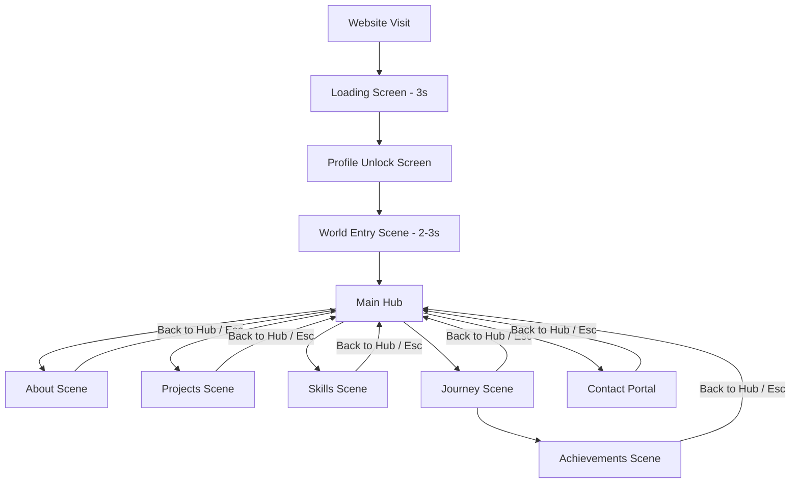

# Product Requirements Document (PRD)

## Project Name: Shivam's World – Interactive Game-Based Portfolio
**Version:** 1.0  
**Owner:** Shivam Singh  
**Date:** June 14, 2026  

---

## 1. Executive Summary & Objectives
**Shivam's World** is a fully interactive, game-inspired portfolio experience. Unlike traditional scrolling portfolio websites, visitors navigate Shivam's digital world through a series of connected scenes, transitions, immersive audio cues, and deliberate user interactions.

The core goal is to replicate the feel of a modern game menu system while maintaining a professional standard suitable for recruiters, startup founders, brands, and potential collaborators.

---

## 2. Core Experience & User Journey
The user experience flows linearly through the initial entry stages, opening up into a non-linear hub-and-spoke model once they reach the Main Hub.



---

## 3. Technology Stack & Architecture

### Frontend Stack
*   **Framework:** Next.js 15+ (App Router)
*   **Library:** React 19+ (Concurrent Features, Hooks)
*   **Language:** TypeScript (Strict Type Safety)

### Styling & Animation
*   **Styling:** Tailwind CSS (for layout utilities) paired with **CSS Variables** (for theme constraints)
*   **Animations:** Framer Motion (for scene transitions, layout animations) & GSAP (for complex timelines, portal/zoom effects)
*   **Icons:** Lucide React

### Immersive Systems
*   **Audio Library:** Howler.js (efficient audio loading, playback controls, spatial fading if needed)

### Deployment & Environment
*   **Hosting:** Vercel (Optimized for Next.js)
*   **Version Control:** Git & GitHub

### Architecture Type
*   **Single Page Application (SPA):** Scene management is handled entirely client-side via React state management.
*   **Navigation Type:** Scene-based navigation. No traditional document scrolling is allowed.
*   **State Tracker:** A global or context-based `currentScene` state variable determines which scene is active in the viewport.

---

## 4. Scene-by-Scene Specifications

The application manages ten distinct scenes:
`loading`, `profile_unlock`, `world_entry`, `main_hub`, `about`, `projects`, `skills`, `journey`, `achievements`, `contact`.

| Scene Name | Purpose | Core Components | Interactions & Animations | Audio Cue |
| :--- | :--- | :--- | :--- | :--- |
| **Loading** | Preload assets & set the mood | Logo, Loading Text, Progress Bar (0% → 100%) | Automatic progress over 3 seconds; auto-navigates upon finish | Loading Ambience (Looping) & Completion Sound |
| **Profile Unlock** | Create an interactive entry gate | Portrait Image, "Player Found" Text, "Click to Continue" Button | Image hover scales `1.05`; click triggers zoom animation & unlocks the world | Unlock Sound |
| **World Entry** | Immersive portal transition | "Entering Shivam's World" text | Portal effect, camera zoom, screen fade-out (duration: 2-3 seconds) | World Loading Ambience |
| **Main Hub** | Central dashboard for the portfolio | Interactive navigation cards (About, Projects, Skills, Journey, Contact) | Card hover scales `1.03` with a subtle glow border; card click loads the scene | Hub Background Soundtrack (Looping), Card Hover & Click sounds |
| **About** | Professional profile & focus areas | Profile Photo, Bio Introduction, Role, Mission, Focus Areas (Web Dev, Startups, AI), Back Button | Fade-in scene transition, back button scales `0.98` on click | Hub Background Soundtrack (ambient variant) |
| **Projects** | Highlight missions & achievements | Main Mission: **CollabKaro**, Side Missions (other projects), Demo/GitHub Links | Project selection triggers detail panels, slide-in details | Mission Activation Sound |
| **Skills** | Technical and entrepreneurial capabilities | Expandable skill cards (Java, Web Dev, React, Node.js, DSA, AI, Entrepreneurship) | Accordion expand / slide reveal | Knowledge Unlock Sound |
| **Journey** | Interactive career timeline | Interactive points (Levels 1 to 8), Detail Modal, "View Achievements" button | Clicking checkpoints opens modal overlay | Checkpoint Sound |
| **Achievements** | Highlight accomplishments / gamify portfolio | Achievement Cards (Founder Mindset, Built Real Projects, Continuous Learner, Impact Focused), Modal details | Cards reveal detail modal on click | Achievement Unlock Sound |
| **Contact** | Contact portal / call-to-action | "Final Quest" title, email/social links (GitHub, LinkedIn, Instagram), message form | Portal ambience, form submission feedback animations | Portal Ambience (looping), message send sound |

---

## 5. Audio & Sound System (Mandatory)

Immersive audio is a core requirement. We utilize **Howler.js** to handle buffering, playbacks, and volume controls.

### Global Controls
*   **Sound Toggle:** On / Off switch, persisted globally.
*   **Volume Slider:** Logarithmic volume scaling (0% to 100%).
*   **Persistence:** All settings must be stored in browser `localStorage` and read during the loading scene to ensure persistence across sessions.

### Sound Assets Mapping
1.  **Loading Ambience:** Ambient low-frequency drone (loops during loader).
2.  **Completion Sound:** Quick high-frequency chime (plays when loading completes).
3.  **Unlock Sound:** Mechanical lock disengaging or digital power-up (plays on profile click).
4.  **Hub Background Soundtrack:** A subtle, low-tempo synth-wave or cinematic track (loops in hub).
5.  **UI Hover Sound:** High-speed micro-click or digital hover beep.
6.  **UI Click Sound:** Tactile click sound.
7.  **Mission Activation Sound:** Cinematic swoosh or telemetry sound (plays when viewing projects).
8.  **Checkpoint Sound:** Retro leveling-up note or digital tick (plays when exploring timeline levels).
9.  **Achievement Unlock Sound:** Triumph fanfare or coin collect chime.
10. **Portal Ambience:** Ethereal wind/drone sound (loops in contact scene).

---

## 6. Design System & Theme Constraint

Strict theme constraints are applied to maintain a cinematic, high-fidelity professional tone.

### Palette Specs
*   **Theme:** Dark Theme Only.
*   **Background:** `#050505` (Deep space black)
*   **Surface / Panels:** `#101010` (Dark gray containers)
*   **Cards / Focus Containers:** `#151515` (Elevated blocks)
*   **Borders:** `#242424` (Subtle separator lines)
*   **Primary Text:** `#FFFFFF` (High contrast text)
*   **Secondary Text:** `#A3A3A3` (Medium contrast copy)

> [!WARNING]
> No gradients, RGB neon effects, or glowing rainbow overlays are permitted. The design should remain minimal, cinematic, and professional.

### Typography
*   **Fonts:** `Inter` (Primary) or `Geist` (Alternative).
*   **Weights:** 400 (Regular), 500 (Medium), 600 (Semi-Bold), 700 (Bold).
*   **Feel:** Professional, clean, and cinematic.

---

## 7. Animation Guidelines

All transitions should feel snappy yet organic.

*   **Scene Transitions (Fade/Zoom/Slide):**
    *   *Duration:* `600ms`
    *   *Easing:* `cubic-bezier(0.25, 1, 0.5, 1)` (Out Quart)
*   **Hover States (Interactive Cards/Buttons):**
    *   *Scale:* `1.03`
    *   *Duration:* `200ms`
*   **Button Press (Feedback):**
    *   *Scale:* `0.98`
    *   *Duration:* `150ms`

---

## 8. Persistence & Local Storage Schema
To ensure a persistent experience across browser tabs, the state should structure data as follows:

```json
{
  "audioSettings": {
    "muted": false,
    "volume": 0.5
  },
  "exploration": {
    "visitedScenes": ["loading", "profile_unlock", "world_entry", "main_hub"],
    "completedLevels": ["level_1", "level_2"]
  },
  "achievements": {
    "unlocked": ["continuous_learner"]
  }
}
```

---

## 9. Performance & SEO Requirements

### Performance Specs
*   **Lighthouse Target:** `90+` across Performance, Accessibility, Best Practices, and SEO.
*   **First Contentful Paint (FCP):** Under 3 seconds on standard mobile/desktop devices.
*   **Images:** Strictly utilize `WebP` or `AVIF` formats for graphics, and optimize all portraits/screenshots.
*   **Loading strategy:** Dynamic imports/lazy loading for components and sounds that are not required for the immediate loading/unlock sequence.

### SEO Best Practices
*   **Title Tags:** Contextual document titles based on current active scene (e.g. `Shivam's World - Projects`).
*   **Meta Descriptions:** Immersive description targeting recruiters and collaborators.
*   **Semantic Structure:** Maintain proper sequential headings (`<h1>` tags limited to one per viewport context).
*   **Accessibility:** ARIA labels on custom interactive elements (buttons, slider tracks).

---

## 10. Future Roadmap

### Version 2.0 (The Gamification Update)
*   **Developer Secret Room:** A hidden console accessible via Konami code or terminal input.
*   **Hidden Easter Eggs:** Interactive items hidden inside scenes.
*   **Dynamic Achievements:** Achievements unlocked through actions (e.g., viewing all project links, toggling music 10 times).
*   **Character Progression:** A simple leveling/XP bar based on exploration.

### Version 3.0 (The 3D World Update)
*   **Three.js / React Three Fiber World Map:** Replace flat card hubs with an interactive 3D solar system or control desk.
*   **Interactive Character:** A 3D avatar that walks/drives between sections.
*   **Multiplayer Counter:** Real-time visitor counts and message feeds.
