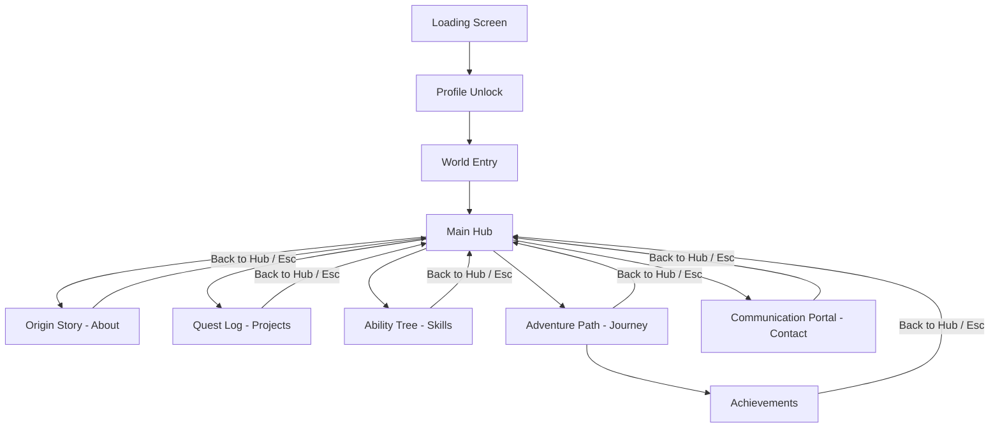

# Technical Requirements Document (TRD)

## Project Name: Shivam's World – Interactive Game-Based Portfolio
**Version:** 1.0  
**Owner:** Shivam Singh  
**Date:** June 14, 2026  

---

## 1. Project Overview
*   **Project Name:** Shivam's World
*   **Type:** Interactive Game-Based Portfolio
*   **Platform:** Web Application
*   **Architecture:** Single Page Application (SPA)
*   **Navigation:** Scene-based, click-driven (no page scrolling or scrolling landing page)

---

## 2. Objectives
*   Create a game-like portfolio experience that immediately engages visitors.
*   Showcase Shivam's projects, skills, professional journey, achievements, and contact details.
*   Provide highly immersive navigation, transition animations, and corresponding audio feedback.

---

## 3. Technology Stack

### Frontend & Language
*   **Next.js 15+** (App Router structure for optimization)
*   **React 19+** (Client-side interactive rendering)
*   **TypeScript** (Strict type checking for robust component state management)

### Styling & Visuals
*   **Tailwind CSS** (Utility layout styling)
*   **CSS Variables** (Dynamic design token mapping for clean dark-theme consistency)

### Animation System
*   **Framer Motion** (Component mount/unmount and layout transitions)
*   **GSAP** (Immersive timeline coordination, zoom sequences, and portal animations)

### Audio Engine
*   **Howler.js** (For loading, caching, polyphonic triggers, and sound volume adjustment)

### Deployment & Tools
*   **Deployment:** Vercel (Continuous deployment from GitHub)
*   **Version Control:** Git + GitHub

---

## 4. Application Architecture & Scene Flow

The scene management is controlled via React client-side state tracking.

---

## 5. Scene Specifications

### 5.1. Loading Screen
*   **Duration:** 3 seconds
*   **Components:** logo, progress bar, loading messages.
*   **Audio:**
    *   Loading ambience (loops on start)
    *   Completion sound (plays upon 100% load)

### 5.2. Profile Unlock Screen
*   **Components:** Portrait image, "Player Found" message, "Click to Continue" button.
*   **Interactions:**
    *   Hover zoom (scale `1.05` on image)
    *   Click to unlock (triggers world entry)
*   **Audio:** Unlock sound

### 5.3. World Entry Screen
*   **Components:** "Entering Shivam's World" message, portal transition animation.
*   **Duration:** 2-3 seconds
*   **Audio:** World-entry ambience (fades out as Main Hub loads)

### 5.4. Main Hub
*   **Components:** Interactive menu cards mapping game-like names to portfolio areas:
    1.  **Origin Story** (About Scene)
    2.  **Quest Log** (Projects Scene)
    3.  **Ability Tree** (Skills Scene)
    4.  **Adventure Path** (Journey Scene)
    5.  **Communication Portal** (Contact Scene)
*   **Interactions:**
    *   Hover glow border and slight scale (`1.03`)
    *   Click transitions (smooth zoom/fade into target scene)
*   **Audio:** Hub background loop, UI hover and click sounds

---

## 6. Projects System (Quest Log)
*   **Main Quest:** **CollabKaro** (Featured project card).
    *   *Fields required:* Title, Description, Role, Core Features, Tech Stack, Demo Link, GitHub Link.
*   **Side Quests:** Grid of additional projects representing minor missions.
*   **Audio:** Quest/Mission activation swoosh sound upon select.

---

## 7. Skills System (Ability Tree)
*   **Categories:** Java, Web Development, React, DSA, AI, Entrepreneurship.
*   **Presentation:**
    *   Visual "Ability Tree" architecture mapping skill levels.
    *   Expandable skill cards utilizing slide-in/accordion animations to reveal details.
*   **Audio:** Knowledge unlock / level-up sound.

---

## 8. Journey System (Adventure Path)
*   **Milestones / Levels:**
    *   *Level 1:* Started Programming
    *   *Level 2:* Learned HTML/CSS
    *   *Level 3:* Learned JavaScript
    *   *Level 4:* Entered College
    *   *Level 5:* Built Projects
    *   *Level 6:* Built CollabKaro
    *   *Level 7:* Exploring AI
    *   *Level 8:* Future Loading...
*   **Interactions:** Clicking a milestone opens a detailed modal overview.
*   **Navigation:** Features a prominent CTA button: **"View Achievements"** linking to the Achievements Scene.

---

## 9. Achievements System
*   **Access:** Navigated to from the Adventure Path (Journey Scene).
*   **Core Achievements:**
    *   *Founder of CollabKaro*
    *   *Built Real Projects*
    *   *Startup Builder*
    *   *Continuous Learner*
*   **Components:** Grid of achievement cards displaying requirements; clicking a card displays details in a modal.
*   **Audio:** Triumph/Achievement unlocked fanfare sound.

---

## 10. Contact System (Communication Portal)
*   **Title:** Final Quest
*   **Components:** Contact Form (Name, Email, Message inputs), and social linkages (GitHub, LinkedIn, Instagram, Email).
*   **CTA Message:** *"Let's Build Something Amazing Together"*
*   **Audio:** Portal background loop, message sent sound effect.

---

## 11. Audio Design

### Global Audio Settings
*   **Controls:** Global Audio Toggle (On/Off) and logarithmic Volume Slider.
*   **State Management:** State stored in `localStorage` to persist volume preferences across sessions.
*   **Standard Sounds:** Hover click-ticks and button click-down feed.

### Scene Audio Triggers
*   **Loading:** Loading drone ambience.
*   **Portal transitions:** Low frequency swooshes for world entry and contact portal scenes.
*   **Missions:** Dynamic chime for selecting quests.
*   **Checkpoints:** Digital confirmation note on milestone clicks.
*   **Achievements:** Fanfare/soundtrack highlight on achievement unlocks.

---

## 12. Design System

### Color Palette Spec
*   **Theme:** Dark Theme Only.
*   **Background:** `#050505` (Base background canvas)
*   **Surface:** `#101010` (Floating window / page panels)
*   **Cards:** `#151515` (Interactive button and data cards)
*   **Borders:** `#242424` (Subtle separator lines)
*   **Text (Primary):** `#FFFFFF` (High-contrast text)
*   **Secondary Text:** `#A3A3A3` (Body copy/subtle headers)

### Strict Aesthetic Guidelines
*   **No gradients** (solid flats only).
*   **No RGB effects** or rainbow spectrum loops.
*   **No neon colors**. Keep styling minimal, premium, and professional.

---

## 13. Typography
*   **Primary Font:** Inter (via Google Fonts or local loading).
*   **Alternative Font:** Geist.
*   **Style guidelines:** Modern, minimal, clean, cinematic feel.

---

## 14. Performance Requirements
*   **Lighthouse Performance Score:** 90+ on both Mobile and Desktop audits.
*   **First contentful load:** < 3 seconds.
*   **Image assets:** Strictly `WebP` or `AVIF` formats.
*   **Asset Loading:** Code splitting, dynamic imports for sound files and scene sub-components.

---

## 15. Future Roadmap

### V2 (Gamification Expansion)
*   Hidden Developer Room (Terminal console entry).
*   Dynamic Easter Eggs scattered in scenes.
*   Dynamic Achievements linked to user actions (e.g. visiting all scenes).

### V3 (3D Immersive Expansion)
*   Three.js/WebGL-based interactive star field or dashboard navigation.
*   Interactive 3D character avatar controller.
*   3D environments and live visitor counter.

---

## 16. Success Criteria
1.  **Engagement:** Visitors click and explore multiple scenes rather than immediately bouncing.
2.  **Immersive Feel:** Site successfully reads and behaves like a game interface.
3.  **Dwell Time:** User engagement time is higher than average portfolio bounce rates.
4.  **Information Delivery:** Effectively demonstrates Shivam's technical skills, key projects (CollabKaro), and entrepreneurial mindset.
